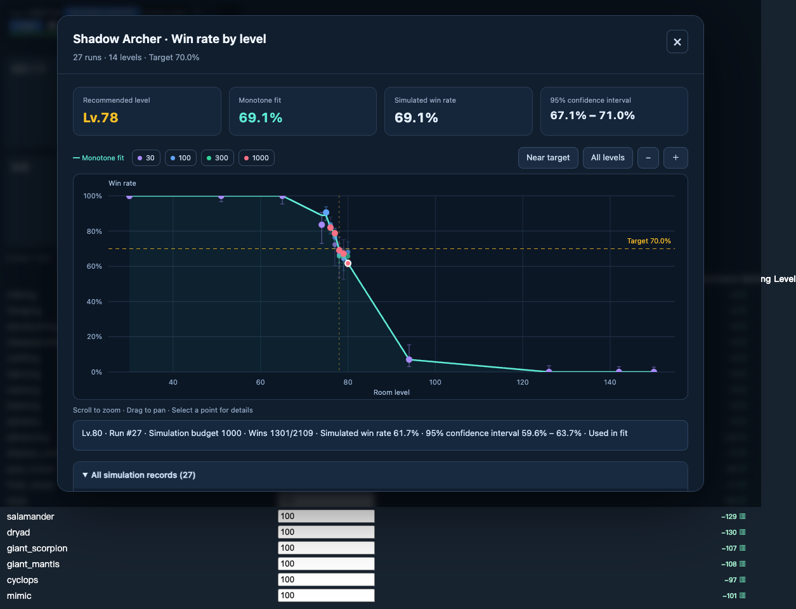
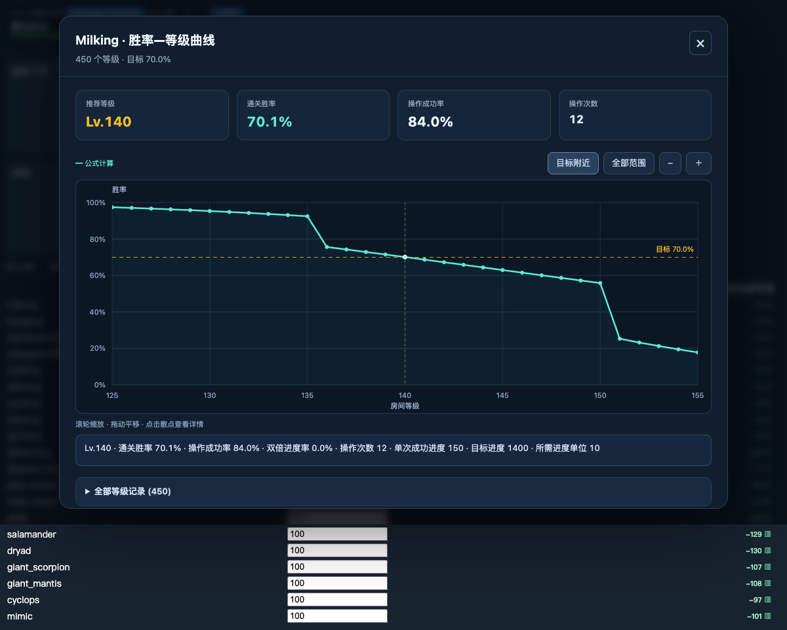

# 迷宫胜率计算器

银河奶牛（Milky Way Idle）的迷宫计算与等级推荐用户脚本。基于原版 1.5.14，提供 Rust/WASM 战斗引擎、渐进模拟与单调回归推荐，以及战斗、生产房间的胜率—等级图。

当前计算器版本：**1.6.4**。包含安装脚本、构建源码、Rust 引擎源码和回归测试。

## 安装

先安装 Tampermonkey 或 Violentmonkey，再通过脚本管理器导入下面的一个文件：

| 版本 | 安装文件 | 适用情况 |
|---|---|---|
| Rust 内置修正版（推荐） | [labyrinth-clear-rate-rust-embedded.user.js](labyrinth-clear-rate-rust-embedded.user.js) | 希望沿用原版迷宫规则；战斗引擎包含在脚本中 |
| Rust 远程上游版 | [labyrinth-clear-rate-rust-remote.user.js](labyrinth-clear-rate-rust-remote.user.js) | 希望使用 wow121 站点提供的上游引擎；首次战斗计算下载 WASM |

安装后停用原版计算器及另一个 Rust 版本，刷新游戏页面。每次只启用一个计算器。生成版本已移除原版的自动更新地址，升级时重新导入对应文件。

内置版的“内置”指战斗引擎；游戏和脚本的 LZString 依赖仍需网络。远程版在浏览器内下载引擎和计算，不向引擎站点上传角色配装。两版的战斗规则存在差异，结果可能不同，详见[计算器说明](calculator/README.md)。

## 使用

1. 在游戏中设置各房间的迷宫配装及茶箱、咖啡箱、食物箱。
2. 点击“计算迷宫”，查看格子上的通关率和预计通关耗时。
3. 在自动化表格中设置目标胜率（默认 **70%**），点击推荐按钮，计算房间推荐等级。
4. 点击带 **▥** 的推荐等级打开对应图表；键盘聚焦单元格后也可按回车或空格。

表格显示的是可填写到“跳过如果高出等级”的**等级差 +1**，图表顶部显示实际房间等级。配装或升级改变后，重新计算推荐以更新图表。

图表默认聚焦目标附近，支持滚轮缩放、拖动平移、查看全部范围和点击记录定位。黄色横线表示目标胜率，竖线标记推荐等级。Esc、关闭按钮或点击遮罩可关闭图表；桌面和手机均可使用。

## 战斗房间

战斗推荐分阶段使用 **30 → 100 → 300 → 1000** 的模拟预算。在候选等级附近提高预算并重新拟合，最终入选等级经过 1000 预算复核。

这里的“次数”表示 **120 秒 × 预算**的连续战斗游戏时间，不等于严格的独立对局数。胜率分母和拟合权重使用引擎返回的实际统计次数。

- 使用加权单调回归（PAVA），约束拟合胜率随房间等级不升高。
- 在搜索范围内寻找拟合胜率最接近目标的已模拟等级，允许低于目标；偏差相同时选更高等级。
- 图表保留本轮推荐的所有模拟调用，包括同一等级被较长运行替换的历史结果。每个等级只有最新结果参与拟合，历史样本不会重复累加。
- 紫、蓝、绿、粉红色分别对应四档预算；可通过图例筛选。青色曲线表示最终单调拟合。
- 误差棒表示每轮原始胜率的 **95% Wilson 二项置信区间**，按实际统计次数计算。连续战斗按独立试验近似，区间不是拟合曲线的置信带。



## 生产房间

普通生产和强化房间直接使用原概率公式计算，不需要随机模拟或单调拟合。

- 逐级计算整个推荐范围：有效技能等级向下取整后 **−300～+300**，最低房间等级为 1。
- 保留原生产推荐算法；图表展示每个整数等级的公式胜率，以及取整带来的阶梯变化。
- 点选等级可查看操作成功率、双倍进度率、120 秒内操作次数、单次成功进度和所需进度单位。
- 强化房间显示目标强化等级，计算在时间内首次达到 **+5** 的概率。
- 完整等级表保留全部计算结果。生产图不显示模拟预算或采样置信区间。



## 项目结构

```text
.
├── labyrinth-clear-rate-rust-embedded.user.js  # 内置版安装文件
├── labyrinth-clear-rate-rust-remote.user.js    # 远程版安装文件
├── labyrinth-clear-rate.user.js               # 未修改的原版 1.5.14 基准
├── labyrinth-engine-comparison.user.js        # 双引擎对比工具
├── calculator/                               # 计算器适配、推荐、图表及测试
├── comparison/                               # 引擎对比、构建依赖及回归测试
│   ├── engine/                               # Rust 引擎源码
│   ├── assets/                               # 已编译的内置 WASM
│   └── vendor/                               # 固定的第三方引擎快照
└── docs/images/                              # 图表示例
```

安装只需要选择一个计算器 `.user.js` 文件。`calculator/` 和 `comparison/` 用于开发；[双引擎对比工具](comparison/README.md)可用于检查相同输入下的规则、胜率及耗时差异。

## 开发与验证

以下命令从本仓库根目录开始执行。需要 **Node.js 20 或更高版本**和 npm；现有回归使用 Node.js 23。已编译 WASM 随仓库提供，构建用户脚本不需要安装 Rust。

```sh
cd comparison
npm ci

# 构建两个 Rust 计算器安装文件
node ../calculator/build.mjs

# 运行计算器和引擎的 Node 回归测试
npm test

# 运行计算器真实浏览器回归
node ../calculator/tests/browser.mjs
```

浏览器测试使用隔离的 Chrome 会话、本地页面和合成角色数据。当前测试脚本的 Chrome 路径为 macOS 的 `/Applications/Google Chrome.app/Contents/MacOS/Google Chrome`；其他系统需要调整测试文件中的 `executablePath`。截图和测试 JSON 写入 `comparison/tests/browser-results/`，不纳入版本管理。

开发时修改 `calculator/` 源码，再运行构建器更新两个安装文件。不要仅编辑生成的 `.user.js`，否则下次构建会覆盖改动。构建器检查原版基准文件的 SHA-256，防止在未复核兼容性的情况下更换原版。

双引擎对比工具的构建与浏览器测试，在上述 `comparison/` 目录执行：

```sh
npm run build
npm run test:browser
```

修改 Rust 引擎后需重新编译 WASM、替换 `comparison/assets/mwi_engine.wasm`，再构建安装文件。具体命令和统计口径见[引擎开发说明](comparison/README.md#开发和验证)。

## 来源与许可

- 原计算器：dakonglong，[Greasy Fork 566829](https://greasyfork.org/zh-CN/scripts/566829)，本仓库保留下载的 **1.5.14** 原文件，元数据声明 MIT。
- 原 JS 战斗引擎：[shykai/MWICombatSimulatorTest](https://github.com/shykai/MWICombatSimulatorTest)。
- Rust 核心与适配模块：[wow121/mwi-fastsim](https://github.com/wow121/mwi-fastsim)，本地引擎基于提交 `115f48d94b5c230a5bb0d5f84110bb503a29ecd4`，加入原版迷宫规则及统计适配。

第三方代码保留其作者、来源和现有许可声明。此仓库从当前本地文件建立独立历史，不包含上游项目的 Git 历史。更详细的规则差异、哈希和来源记录见[计算器说明](calculator/README.md)与[对比工具说明](comparison/README.md)。
